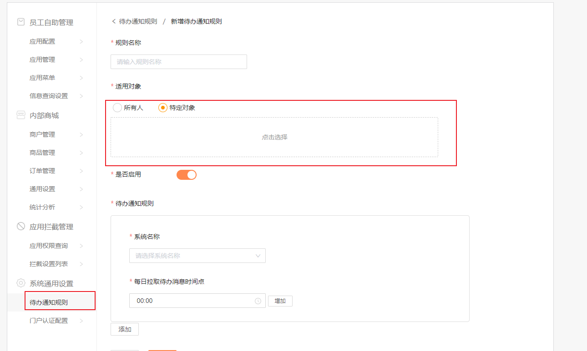

### 广州发展项目

- [ ] 解决【管理端】待办通知规则模块编辑待办通知规则中特定对象导致无法保存的问题

  |       |  |
  | ------------------------------------------------------------ | ------------------------------------------------------- |
  | https://app.gdg.com.cn/mgr/mgr/gzfztodo/editAgencyRules.do   | agecyRulesTargetVOS                                     |
  | https://app.gdg.com.cn/mgr/mgr/gzfztodo/getById.do?rulesId=088212daf0ff454f89796ef0f09abd54 | selectTagVOList                                         |

  - [x] 前端这边的问题解决，但是后端似乎还有问题

- [x] 修改人工成本和薪资查询的层级样式（修改完，未测试）

|  |  |
| ------------------------------------------------------- | ------------------------------------------------------- |
|                                                         |                                                         |

- [ ] 对接【管理端】应用商店模块接口
  - [ ] 等测试通过后就加到测试环境去

​	

- [ ] 既然不同的页面是否需要不同权限

### github设置

- [ ] 翻译以下两段文字

|       |  |
| ------------------------------------------------------------ | ------------------------------------------------------- |
| 尝试github讨论！ 讨论discussions 允许 社区成员展开讨论和问问题不需要打开时间，通过 |                                                         |

- [ ] 设置github的growing仓库私有