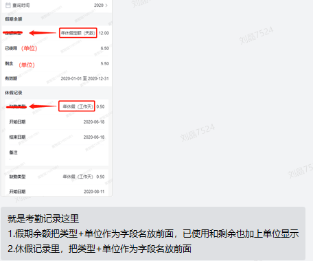
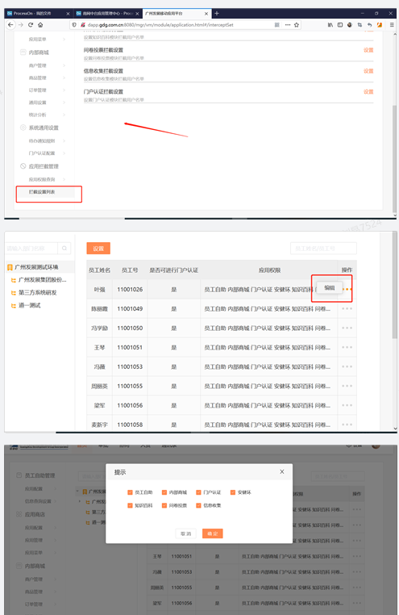

- [ ] 整理权限让后端写脚本
- [x] 1.假期余额把类型+单位作为字段名放前面，已使用和剩余也加上单位显示
  2.休假记录里，把类型+单位作为字段名放前面

- [ ] 增加应用商店模块

- [ ] 应用拦截后台新增批量导入功能

应用拦截查询模块，增加批量导入功能，支持批量更新用户应用访问情况
详细需求说明：
1.通过Excel表格形式批量导入，导入成功后，系统根据录入的数据批量导入更新应用访问情况。
2.批量更新时须判断所录入的数据用户及应用，是否在当前导入用户的权限范围内，如不在范围内则导入失败
3.导入失败须支持下载导入结果，记录每条记录的导入失败结果
位置：后台，应用拦截管理-应用权限查询

- [ ] 是否下属页面如何跳转