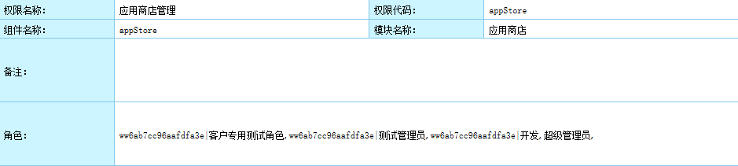
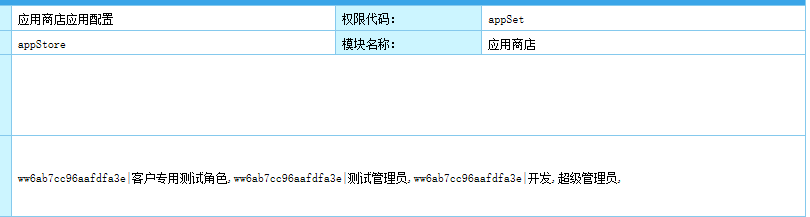
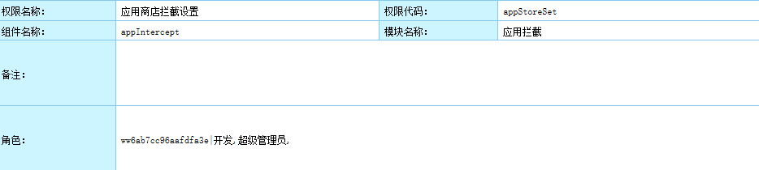
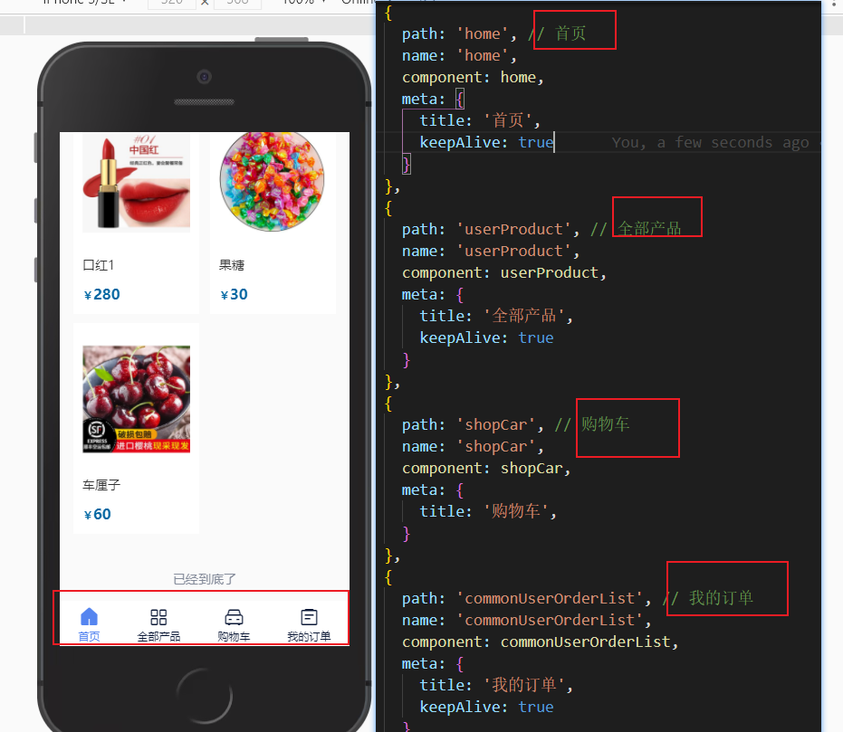
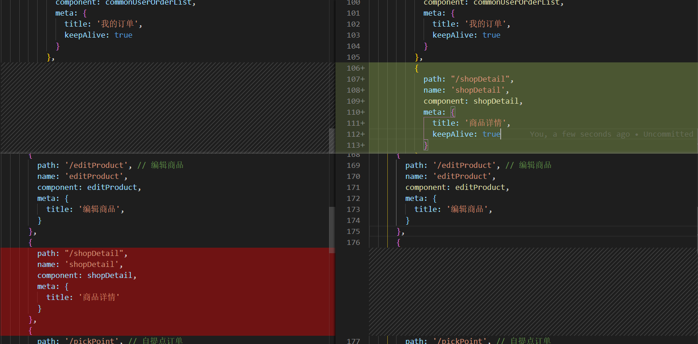

上班每小时拉伸一次，休息15分钟

下班之后不能再看手机了

以后运动是肩颈运动+自定义运动+拉伸运动

每周去天河公园跑步

坐姿正确

1. 检测上周有什么没做好的？复盘以下，这周应该是对接口吧~还有钦玮和耿豪的接口没对好，然后就是优化
2. 希望自己能把工作做得再细致一点
3. 

纳税人识别号 92440101MA5D77XC36

发票代码 144002009010

发票号码 04698077

开票日期 2020/12/11

发票金额 475

开户行及账号 6222083602009619393

- [x] 给后端整理权限--应用商店

|                                                         |      |
| ------------------------------------------------------- | ---- |
|  |      |
|  |      |
|  |      |

 [vue keep-alive 返回到原来的页面 仍然调用了created和mounted方法](https://segmentfault.com/q/1010000012929600)

 vue中keepAlive页面缓存，[详情页返回列表页刷新问题](https://blog.csdn.net/qq379682421/article/details/105771691?utm_medium=distribute.pc_relevant_t0.none-task-blog-BlogCommendFromBaidu-1.control&depth_1-utm_source=distribute.pc_relevant_t0.none-task-blog-BlogCommendFromBaidu-1.control)

 vue项目实现从商品列表页跳转详情页后，返回列表页保持页面在原位置，[且列表页刷新的方法](https://blog.csdn.net/weixin_40403102/article/details/108165164)

 [vue中keepAlive的使用](https://segmentfault.com/a/1190000019610283)

 Vue中keep-alive[的深入理解和使用](https://juejin.cn/post/6844903918313406472)

 vue项目中使用[keepAlive](https://www.jianshu.com/p/9cefe3d27449)

线索1：四个底部tab菜单路由处于同一个层级，能够实现keepAlive

线索2：将订单详情移至与首页同一层级路由， 滑动出现异常，但是keepAlive生效，并且数据有问题

https://app.gdg.com.cn/portal/vp/module/employeeSS.html?corp_id=ww6ab7cc96aafdfa3e#/

企业红包 /manager/redpack/main.jsp

| 消息管理 | 本系统 | /manager/message/listByOrg.jsp             |
| -------- | ------ | ------------------------------------------ |
| 工作圈   | 本系统 | /vm/module/cooperative.html#/dynamicCircle |

http://dapp.gdg.com.cn:8080/mgr/vm/module/cooperative.html#/todoManager/todoManagerList