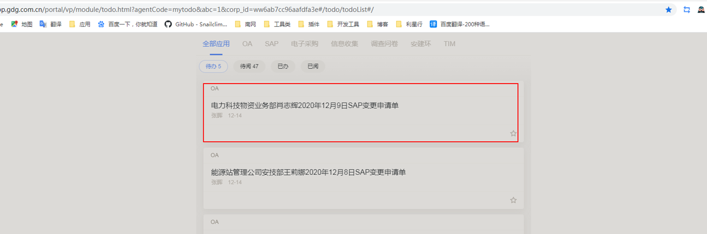
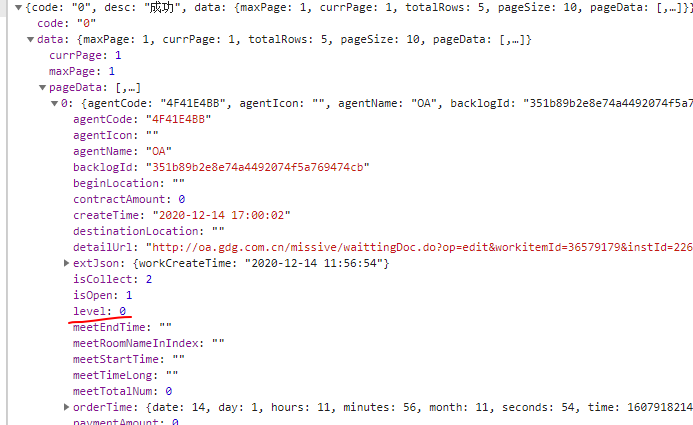
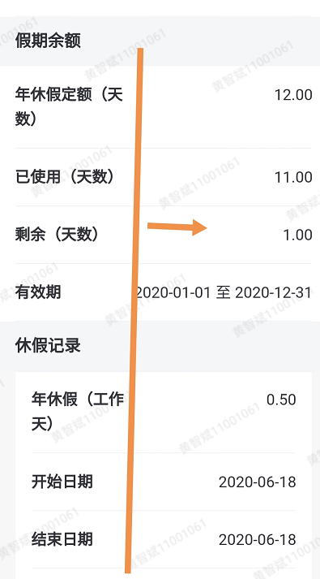
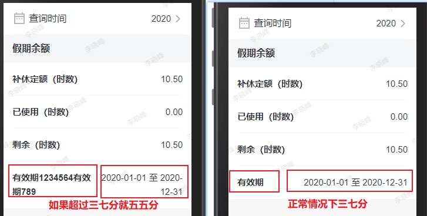
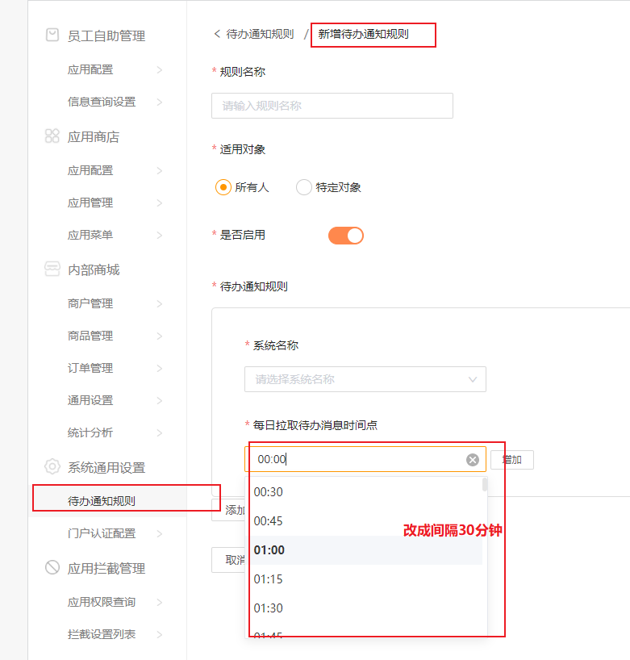

今天先把昨天提出的问题都完成，再去解决难题

- [ ] 统一待办增加紧急状态显示：分三个等级，移动端列表用图案区分显示待办紧急状态

0-最高 1-非常高 2-更高

- [ ] [自从掌握了 Google 和 Baidu 的 16 个高级搜索技巧，再也没有解决不了的 bug 了!](https://segmentfault.com/a/1190000038432191?utm_source=sf-qa)
- [x] 解决年度查询手机屏幕过小但是不允许换行显示问题

http://dapp.gdg.com.cn:8080/portal/vp/module/employeeSS.html?corp_id=ww6ab7cc96aafdfa3e#/laborCostQuery

开始半小时会议，确定周六要加班
重新测试生产环境，发现了一个bug，与后端解说，开始解决

