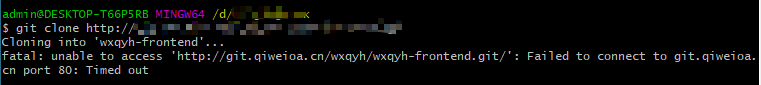
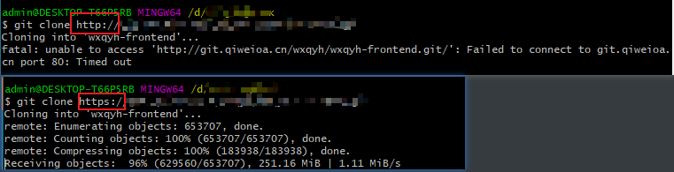
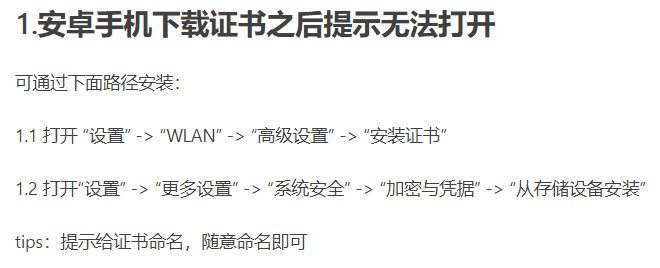

### 问题

项目无法克隆，并报错：unable to access 'http://....git/': Failed to connect to git.... port 80: Timed out

### 解决
另一个同事可以克隆，让他查出远程地址发我一份，命令：git remote -v
通过对比发现远程地址安全性不同，将http更改成https即可


### 总结

遇事不慌张，将可行方案和不可行方案对比一番，可能就找到问题所在

------

### 问题

实现一个功能，点击文本即可复制到剪贴板

### 解决

```html
<input id="demoInput" value="hello world">
<button id="btn">点我复制</button>
```

```js
let btn = document.querySelector('#btn');
btn.addEventListener('click', () => {
	let input = document.querySelector('#demoInput'); //获取可编辑元素 例：<input>,<textarea>
	input.select();  //select() 方法用于选取文本域的内容
	if (document.execCommand('copy')) //bool = document.execCommand(aCommandName, aShowDefaultUI, aValueArgument) 返回值是布尔值，表示是否支持
		document.execCommand('copy');
		console.log('复制成功');
	}
})
```

 **`document.execCommand()`语法**

`bool = document.execCommand(aCommandName, aShowDefaultUI, aValueArgument)` 返回值是布尔值，表示是否支持。
`aCommandName`: 命令名字,`copy,cut`等
`aShowDefaultUI`:一个 `Boolean`， 是否展示用户界面，一般为 false。
`aValueArgument`:一些命令（例如insertImage）需要额外的参数（insertImage需要提供插入image的url），默认为null,一般不用。

### 参考

-  [执行浏览器复制命令](https://blog.csdn.net/weixin_34380781/article/details/93022302)


- [js原生方法document.execCommand()复制到粘贴板](https://www.dazhuanlan.com/2019/10/26/5db44452f0680/)
-----

### 问题

p30华为手机下载charles证书后无法安装

## 解决



## 参考

[安卓手机无法安装charles证书问题](https://www.jianshu.com/p/c426f9a09a51)

