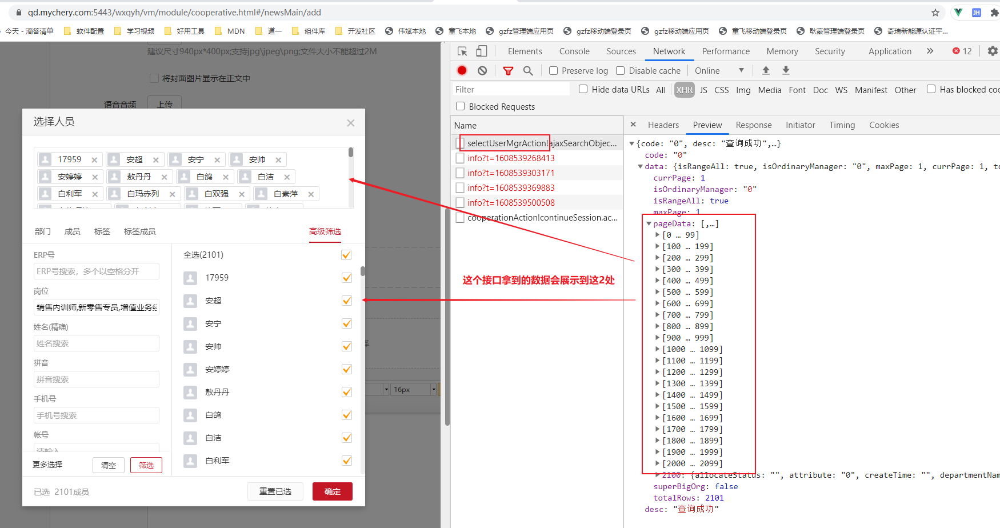
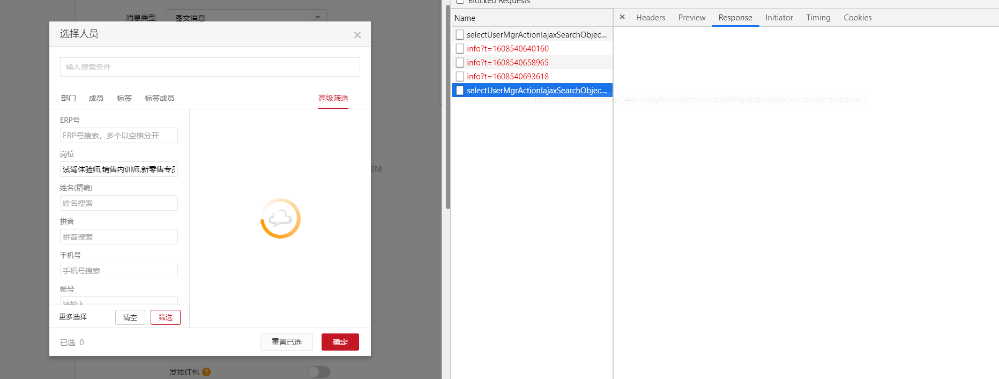
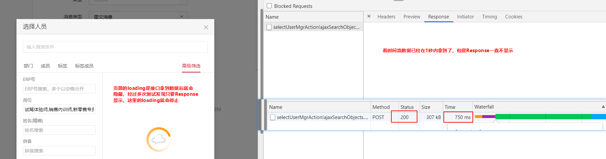
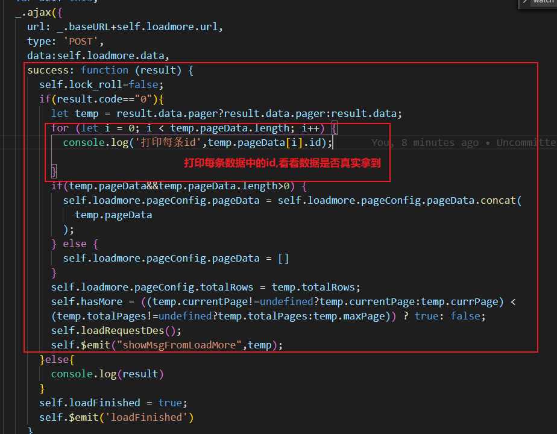
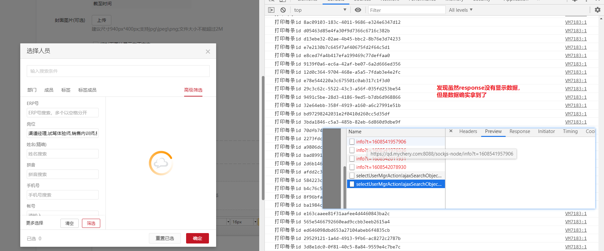
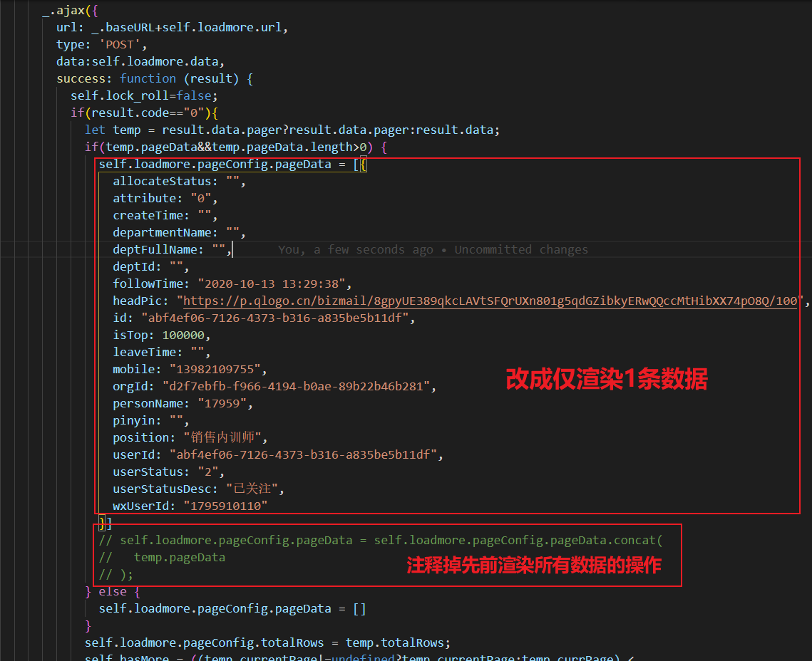
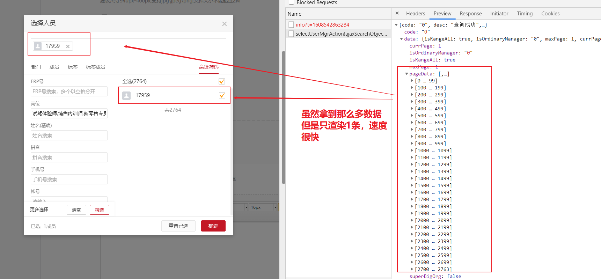
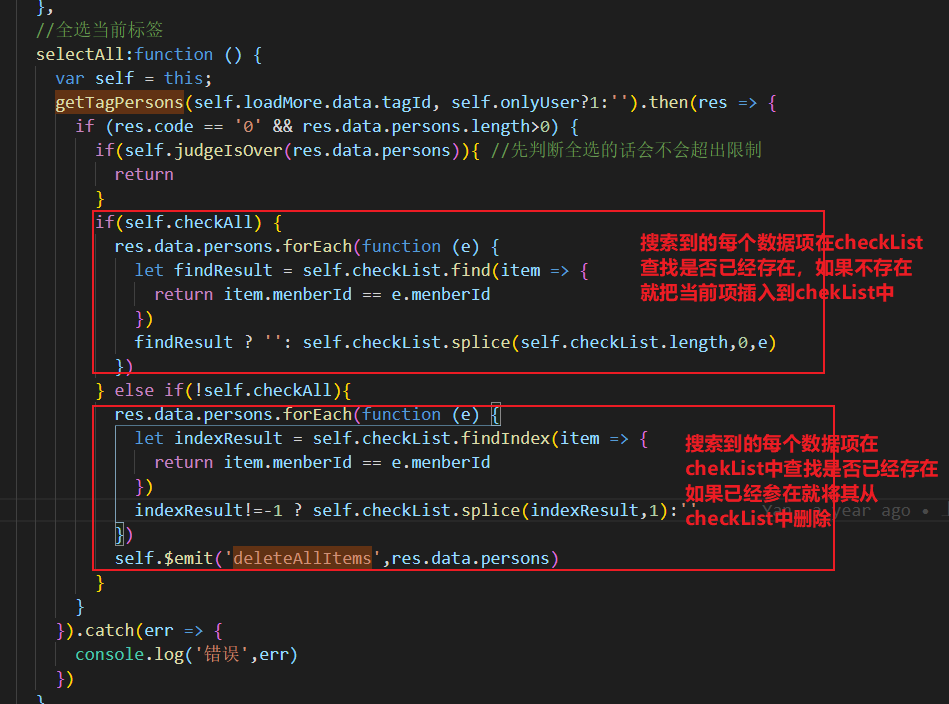

记一次排查问题的能力

页面加载慢，到底是后端返回的数据慢，还是前端渲染慢导致的呢？
发现以下线索让我们模糊到底是前端还是后端问题

### 预期效果：

### 实际效果：点击一次全选需要很长时间才显示

线索1：看接口时间流请求成功并顺利返回数据
推测1：接口没问题，但是response为什么一直没展示数据呢？到底数据有没有拿到？

测试1：排除数据没有拿到的可能性

线索2：在请求接口后拿到每个数据的id号，虽然页面没显示，但是数据是真真切切拿到了的

推测2：数据确实拿到了，有可能是数据多，渲染耗费的时间长导致的
测试2：试着只渲染1条数据

线索3：数据很多，但是传输得也很快，主要是渲染花费大量的时间
结论：由于渲染导致页面长时间处于loading状态
解决方案：不要一次性渲染所有数据，使用下拉加载更多，10条10条加载

----

热更新

----

