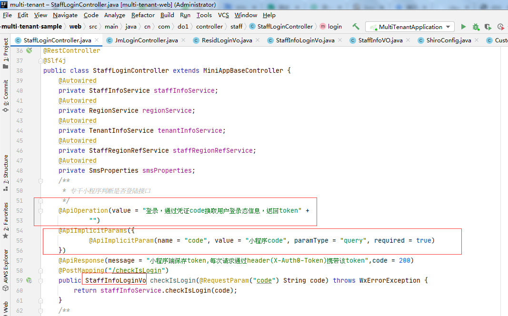

前端，接口返回40001错误码时，需要从新走登录流程（默认的走），后端，业务代码错误，不能返回40001码

域名（https协议的接口地址）： https://desyb2.do1.net.cn/jkzsjwj/swagger-ui.html 
前缀 ：https://desyb2.do1.net.cn/jkzsjwj 

前端，接口地址前缀（https://desyb2.do1.net.cn/jkzsjwj/v1/jkzsjwj/）。这个是不同服务端不同地址的。要全局配置，到时候统一改@胡科 跟前端说一下

- **小程序端上传图片最佳的实践方案**：小程序端直接调用cosapi上传。然后返回图片路径传到后端保存
  **小程序端的api**: https://cloud.tencent.com/document/product/436/31953

http://192.168.109.114:8001/swagger-ui.html

查看的时候如果有头像则显示头像，没有则显示默认头像

把swagger的注解使用起来，返回的对象类。都要标识上swagger的注解。后端跟前端的对接，就是靠swagger里的信息。不要单独私聊告诉字段的意义。直接标注在swagger上。更省时间。请求的参数和返回的参数都要标识清楚。还有方法的意义也有标识清楚

进公司那么久做的第一个跟腾讯有关的项目【国家卫健委】

什么时候用bindtap什么时候用bindclick?

专干端：
专干列表: pages/manager/manager
专干信息：pages/managerInfo/managerInfo

441622199703172568
13519856524

administrationDetail    getManagerInfo
deleteAdministration    delManagerInfo

updateAdministration   updateManagerInfo
addNewAdministration     addManagerInfo

{

​      'Content-Type': 'application/json',

​      'Access-Control-Allow-Origin': '*',

​      'Access-Control-Allow-Headers': 'origin,accept,content-type'

​     }