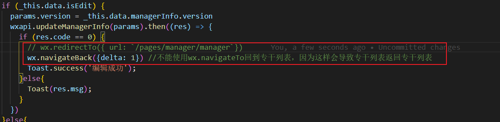

今天到底怎么过，我该吃什么？我想吃素一点，但是又希望能好吃一点，便宜一点。银记吧，这个可信赖，午餐就这样决定了
晚餐该怎么吃呢？

记一次微信小程序跳转问题
功能： 列表页点击对应人员进入详情页，编辑完后回到列表页
异常：多次编辑保存返回详情页后，点击后对应人员无法跳转

下图定位问题不是点击事件没被触发，而实无法跳转，并报错fail webview count limit exceed，报错由于小程序的页面栈超过10层

分析：下图是错误的入栈顺序：首页入栈，列表页1入栈，列表页2入栈，回退列表页1

分析：下图是正确的入栈顺序：首页入栈，列表页入栈，回退列表页

异常：这样的修改确实能够让跳转正常，但是因为有缓存导致修改详情页后回退列表页没有更新
解决：所以在回退操作之前要对列表页重新加载
